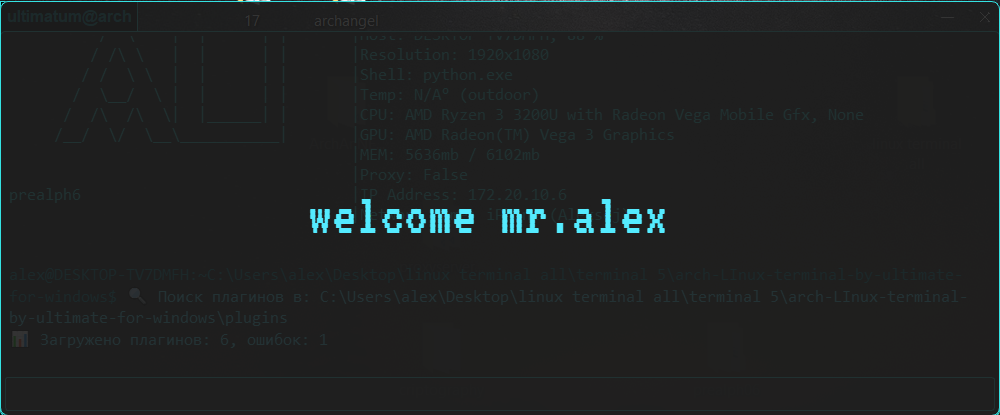

# arch-LInux-terminal-by-ultimate-for-windows, prealphver06
 

## *ru* 
Терминал (интерпритатор коммандных строк) в стиле Arch Linux для Windows с мониторингом показателей и интегрированным Telegram-ботом

## 🔥 Основные функции
- Аутентичный интерфейс Arch Linux
- Комплексный мониторинг (CPU/RAM/сеть/батарея)
- Встроенный Telegram-бот для удаленного доступа (в будущем удалённое управление через Telegram-бота)
- Полноценная командная строка(Поддержка обычных команд cd, clear и др. с защитой от <s> длбёба</s>  )
- Гибкая система команд/плагинов

## 🚀 фаст старт

1. Установите зависимости:
pip install PyQt5 psutil python-telegram-bot python-dotenv requests wmi

2. Настройка:
- Создайте .env файл:
- BOT_TOKEN=ваш_токен_бота
- ALLOWED_CHAT_ID=ваш_id_в_телеграмме
- CITY=название вашего или иного города
- WELCOME_WINDOW=начальная заставка
- POWERFUL_USER=полный доступ к командам (да/нет (0/1))

3. Запуск:
python "arch Linux main.py"
  
## 📊 Мониторинг системы

Требования: OpenHardwareMonitor для температуры CPU

Частота обновления:
- Время: 1 сек
- RAM: 5 сек
- Система/Сеть: 60 сек
/можно поменять в любой момент/

## 📚 Используемые библиотеки/требования:
PyQt5, platform, psutil, datetime, time, 
subprocess, requests, winreg, wmi, os, 
socket, sys, python-telegram-bot, python-dotenv

*Python 3.12.4+ | Windows 10/11*
**Для полного функционала требуются права администратора**

## 📅 История версий:
prealpha-v0.1 (24.07.2025): Базовая логика

prealpha-v0.2 (26.07.2025): Командная строка

prealpha-v0.3 (27.07.2025): Telegram-бот

prealpha-v0.4 (28.07.2025): Логирование

prealpha-v0.5 (31.07.2025): Переработана логика подключения к tg + изменения логики commandline

prealpha-v0.6 (15.08.2025): Интеграция системы плагинов, обновление дизайна 

prealpha-v0.7 (19.08.2025): Добавлена начальная заставка, новые команды, level up security, hotfix

**📌 Проект находится в активной разработке.**

## *en*
Arch Linux-style terminal for Windows with indicator monitoring and integrated Telegram bot

## 🔥 Main functions
- Authentic Arch Linux interface
- Comprehensive monitoring (CPU/RAM/Network/battery)
- Built-in Telegram bot for remote access (in the future, remote control via Telegram bot)
- Full-fledged command line(Support for regular cd, clear, etc. commands)
- Flexible command/plug-in system

# Fast start

1. Install the dependencies:
pip install PyQt5 psutil python-telegram-bot python-dotenv requests wmi

2. Setup:
- Create it .env file:
- BOT_TOKEN=your_token_bot
- ALLOWED_CHAT_ID=your_id_in the telegram
- CITY=the name of your or another city 

3. Launch:
python "arch Linux main.py "

## 📊 System monitoring

Requirements: OpenHardwareMonitor for CPU temperature

Refresh rate:
- Time: 1 sec.
- RAM: 5 seconds
- The system/Network: 60 seconds
/ can be changed at any time/

# Libraries/requirements used:
PyQt5, platform, psutil, datetime, time,
subprocess, requests, winreg, wmi, os,
socket, sys, python-telegram-bot, python-dotenv

*Python 3.12.4+ | Windows 10/11*
**Administrator rights are required for full functionality**

## 📅 Version history:
prealpha-v0.1 (07/24/2025): Basic logic

prealpha-v0.2 (07/26/2025): Command line

prealpha-v0.3 (07/27/2025): Telegram bot

prealpha-v0.4 (28.07.2025): Logging

prealpha-v0.5 (07/31/2025): Redesigned TG connection logic + commandline logic changes

prealpha-v0.6 (08/15/2025): Plugin system integration, design update 

**📌 The project is under active development.**
