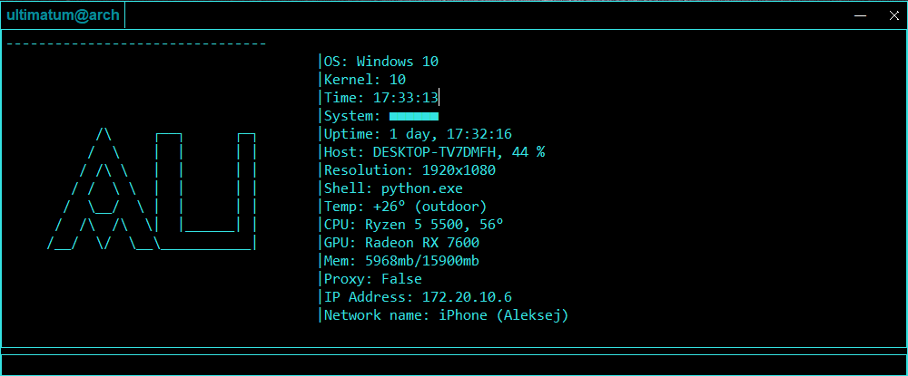

# arch-LInux-terminal-by-ultimate-for-windows, prealphver05
 

ru 

Терминал в стиле Arch Linux для Windows с мониторингом системы и Telegram-ботом

## 📌 Особенности
- Реалистичный интерфейс в стиле Arch
- Мониторинг системы (CPU, RAM, сеть, батарея)
- Встроенный Telegram-бот для удаленного доступа
- Поддержка обычных команд (cd, clear и др.)

## 🚀 Быстрый старт

1. Установите зависимости:
pip install PyQt5 psutil python-telegram-bot python-dotenv requests wmi

2. Настройка:
Создайте .env файл:
BOT_TOKEN=ваш_токен_бота
ALLOWED_CHAT_ID=ваш_chat_id
Для погоды отредактируйте: modules_plus/weather.py -> CITY = "Ваш город"

3.Запуск:
python "arch Linux main.py"
  
## 📊 Мониторинг системы

Требования: OpenHardwareMonitor для температуры CPU

Частота обновления:
Время: 1 сек
RAM: 5 сек
Система/Сеть: 60 сек

## Используемые библеотеки:
PyQt5, platform, psutil, datetime, time, 
subprocess, requests, winreg, wmi, os, 
socket, sys, python-telegram-bot, python-dotenv

**Python 3.12.4+ | Windows 10/11**
**Для полного функционала требуются права администратора**

